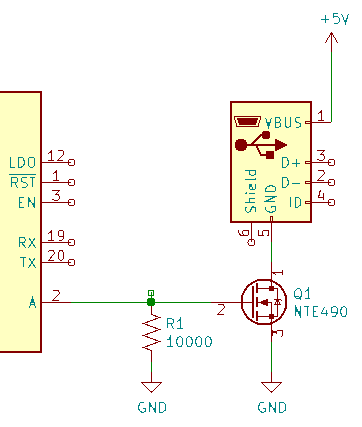
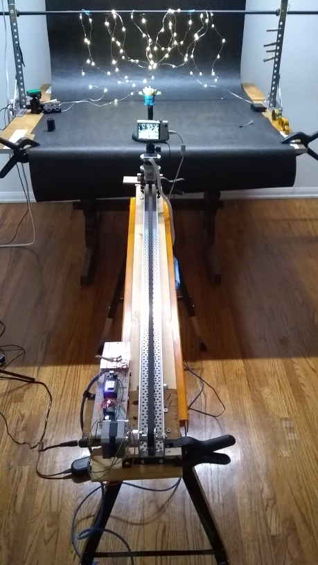
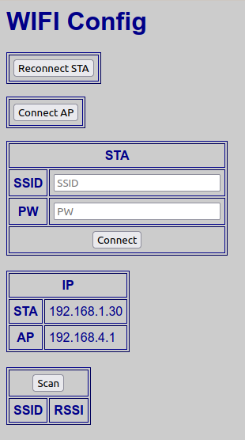
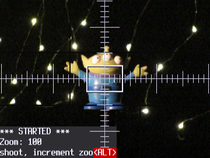
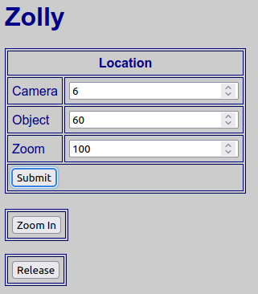
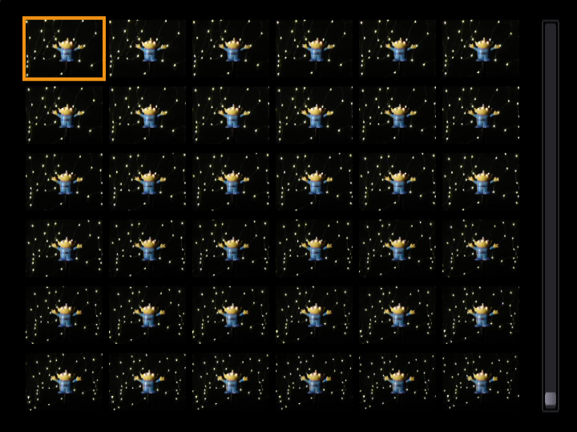
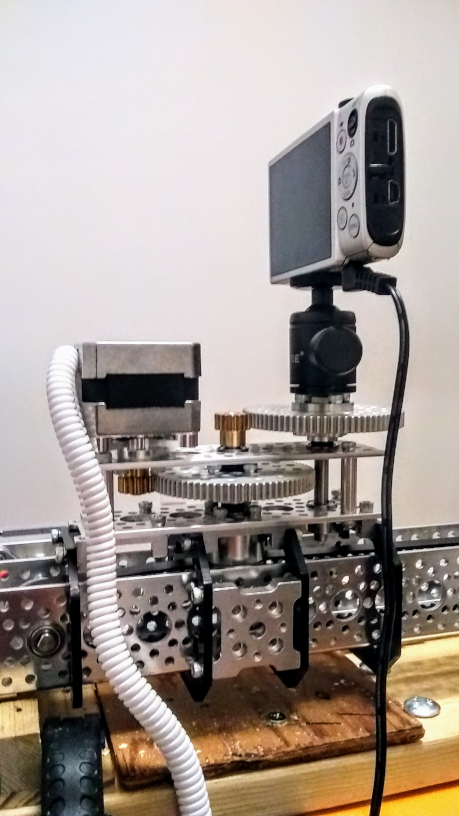

# Zolly
Dolly Zoom using ESP8266, Canon ELPH330HS, and CHDK (Canon Hack Development Kit).

*A dolly zoom is an in-camera effect where you dolly towards or away from a subject while zooming in the opposite direction.*

CHDK is free software for some (not all) Canon PowerShot compact digital cameras. CHDK controls camera features using uBASIC and Lua scripts, enabling time lapse, motion detection,  etc.  (https://chdk.fandom.com/wiki/CHDK)

CHDK controls the camera functions: zoom, focus, exposure, and waits for the remote trigger (a 100 mSec pulse on the USB power line)

The ESP8266 is loaded with a table of focal lengths for the camera's zoom lens.  For each zoom step, it calculates the distance required to maintain the image size, moves the camera to that position, then pulses the USB line to trigger the shot.

Camera motion using Actobotics "Channel Slider Kit A" (https://www.servocity.com/channel-slider-kit-a/) with a 48" channel, and a NEMA-17 stepper motor (https://www.adafruit.com/product/324).  Horizontal resolution is approximately 0.38 mm/step (0.015 inches/step) with 42" of travel

The entire process takes about 5 minutes for a 50 frame sequence, or about 6 seconds per frame.

#### Create zoomFocal.h

Load the file `chdk/zmtbl.bas` on the camera; switch to __ALT__ mode; press shutter to start.  The camera lens should extend and rapidly move through all the zoom steps.  The results are saved to: `A/CHDK/LOGS/LOG_0001.TXT`.  Download the file as `zoomFocal.h` and include in the ESP8266 build. 

#### Configure WiFi

The ESP8266 will automatically connect to the last used access point based on configuration saved in flash memory.  
If this is the first time connecting (or the access point is unavailable), this program will create a _soft access point_ with SSID: __zolly__ and Password: __carbondioxide__.
Connect with a WiFi client and browse to __http://zolly.local__ to access the program.

To configure the ESP8266 to use an existing access point, browse to __http://zolly.local/config__, and enter the SSID and PW.  The STA IP is the assigned address on the network:

The ESP8266 will automatically connect to that network on reboot.
.

#### Zolly

Load the file `chdk/zhoot.lua` on the camera; switch to __ALT__ mode; press shutter to start.  The viewfinder will display __*** STARTED ***__ and the current zoom level:

 

On the ESP8266 web page __http://zolly.local__, enter the location of the camera and object (measured to the far end of the camera slider), and the current zoom level.  Press __Submit__.  Press __Zoom In__ :

When it's done you will have a set of images on the camera:

...that can be converted to a stabilized GIF using:  `scripts/createGIF.sh`:

#### Next Up: the Pan Motor

